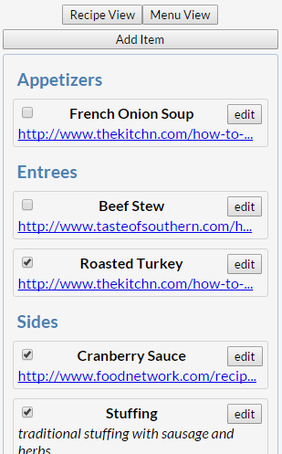
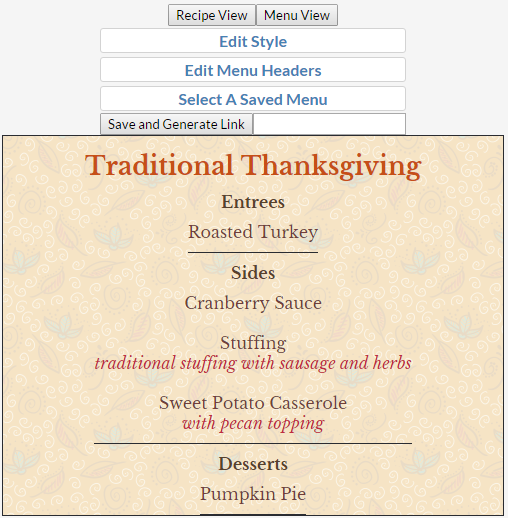
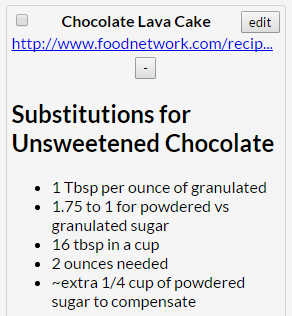

# Menu

This is a project created to help me keep track of things while learning to cook. Save the recipes you know along with notes then create styled menus that are available at a separate static link. View a demo at [dinnernote.com](http://dinnernote.com/) or a static menu [here](http://dinnernote.com/#thanksgiving).

### Track Recipes

### Create Menus and Edit Styling

### Keep Additional Notes using Markdown

